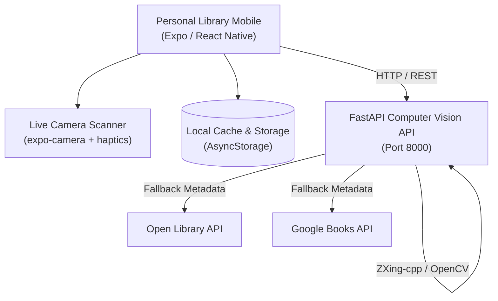

<div align="center">

# Personal Library Mobile

**AI-Powered Personal Library Management System**  
*Final Year Capstone Project (Client Application)*

[](https://www.typescriptlang.org/)
[](https://expo.dev/)
[](https://reactnative.dev/)
[](https://github.com/AvinashK47/personal-library-mobile/actions/workflows/build-apk.yml)

</div>

---

## Overview

**Personal Library Mobile** is a cross-platform mobile client designed to manage physical book collections effortlessly. Built on React Native and Expo, it pairs with a decoupled Python FastAPI Computer Vision backend to provide sub-second ISBN barcode recognition, dual-source metadata resolution, and local collection management wrapped in a Material Design 3 ("Material You") interface.

> [!NOTE]
> This application is engineered to work alongside the [AI Personal Library Backend Service](https://github.com/crowaltz24/personal-library) which processes computer vision tasks, EXIF correction, contrast enhancement, and multi-provider metadata queries.

---

## Key Features

- **Live Camera Barcode Scanner**: Fast barcode scanning using `expo-camera`, featuring interactive scanner reticles, camera torch controls, and instant haptic feedback via `expo-haptics`.
- **Material Design 3 Aesthetic**: Curated warm minimalist palette with slate/teal accents, tactile card elevations, and fluid Newsreader serif and Inter typography.
- **Dual Display Modes**: Toggle between dense list view and cover-art-forward multi-column grid layout in your personal collection.
- **Rich Metadata Resolution**: Automatically populates high-resolution cover artwork, authors, publication year, categories, page counts, and identifiers from Open Library and Google Books.
- **Offline-First Persistence**: Local library storage using `@react-native-async-storage/async-storage` ensures your catalog remains accessible offline.
- **Status & Reading Tracking**: Classify books across *Reading*, *Completed*, and *Wishlist*, record reading progress, and maintain personal notes.
- **Manual Search & ISBN Lookup**: Query books directly by title or ISBN when camera scanning is unavailable.

---

## Architecture



---

## Tech Stack

| Domain | Technology |
| :--- | :--- |
| **Framework** | React Native `0.86` + Expo SDK `57` |
| **Language** | TypeScript `6.0` (Strict typing) |
| **Navigation** | React Navigation `v7` Native Stack & Bottom Tabs |
| **UI & Styling** | Material Design 3, Dynamic Material You colors, Lucide Icons |
| **Hardware** | Camera & Barcode Scanner, Haptic Feedback Engine |
| **Media** | High-performance image caching with `expo-image` |
| **Build & CI** | EAS Build (`eas.json`), GitHub Actions automated APK pipeline |

---

## Getting Started

### Prerequisites

- [Node.js](https://nodejs.org/) (v20 or higher recommended)
- [npm](https://www.npmjs.com/) or [Bun](https://bun.sh/)
- [Expo Go](https://expo.dev/go) on your physical Android/iOS device or a configured Android emulator

### Installation

1. Clone the repository:
   ```bash
   git clone https://github.com/AvinashK47/personal-library-mobile.git
   cd personal-library-mobile
   ```

2. Install dependencies:
   ```bash
   npm install
   ```

3. Configure environment variables:
   Create a `.env` file in the project root:
   ```env
   # Set to your FastAPI backend server URL (e.g. LAN IP for physical device testing)
   EXPO_PUBLIC_API_URL=http://192.168.1.100:8000
   ```

> [!TIP]
> When testing on a physical device over USB or Wi-Fi, ensure your phone and computer are on the same local network, or use `adb reverse tcp:8000 tcp:8000` to route backend requests through `localhost`.

### Running Locally

Start the Metro development server:

```bash
npx expo start
```

Press `a` in the terminal to launch on a connected Android device or emulator, or scan the displayed QR code with the Expo Go app.

---

## Validation & Code Quality

Run static type checking and Expo diagnostic suites:

```bash
# TypeScript compilation check
npx tsc --noEmit

# Expo dependency and configuration audit
npx expo-doctor
```

---

## Building Android APK (Release)

### Option 1: Automated GitHub Actions CI/CD

This repository includes a continuous integration workflow (`.github/workflows/build-apk.yml`) that builds an installable Android APK on every push to `master` or when a version tag (`v*.*.*`) is published.

1. Create and push a git tag:
   ```bash
   git tag v1.0.0
   git push origin v1.0.0
   ```
2. Download the generated `Personal-Library-v1.0.0.apk` directly from the [GitHub Releases](https://github.com/AvinashK47/personal-library-mobile/releases) tab.

### Option 2: EAS Build (Cloud)

Build an APK using Expo Application Services (EAS):

```bash
# Install EAS CLI
npx eas-cli@latest login

# Trigger cloud build for Android APK
npx eas-cli@latest build --platform android --profile preview
```

---

## Project Structure

```text
personal-library-mobile/
├── .github/
│   └── workflows/
│       └── build-apk.yml      # Automated Android APK CI/CD pipeline
├── assets/                    # App icons, splash screens, and adaptive vectors
├── src/
│   ├── components/            # Reusable UI widgets (BookCard, HeaderBadge, etc.)
│   ├── navigation/            # Root stack and bottom tab navigators
│   ├── screens/               # Scan, Library, Search, and Book Detail screens
│   ├── services/              # API clients and AsyncStorage persistence layers
│   ├── theme/                 # Material You dynamic colors and typography
│   └── types/                 # Shared TypeScript models and book definitions
├── app.json                   # Expo application manifest
├── eas.json                   # EAS Build configuration for Android APK targets
├── package.json               # Package dependencies and scripts
└── tsconfig.json              # TypeScript compiler configuration
```
