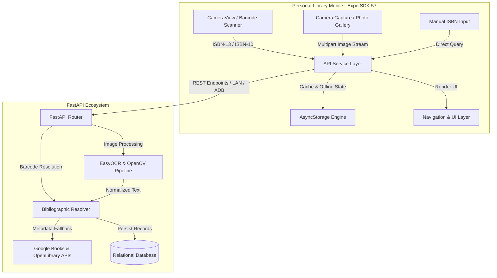

# Personal Library Mobile

An offline-first, mobile-first application for scanning, cataloging, and managing physical book collections. Built with **React Native (0.86)**, **Expo (SDK 57)**, and **TypeScript**, integrated with a computer vision backend for automated book ingestion.

---

## Overview

Cataloging physical books is often slow and repetitive. This application provides a multi-modal ingestion pipeline that allows collectors, researchers, and students to digitize their physical libraries within seconds:

1. **Hardware-Accelerated Barcode Scanning:** Near-instant detection of ISBN-10 and ISBN-13 barcodes using native camera APIs.
2. **Computer Vision OCR (Cover & Spine Recognition):** Optical recognition for books with worn, missing, or pre-ISBN barcodes. Snap a photo of a book's cover or spine—or upload an image directly from your device gallery.
3. **Manual Entry Fallback:** Direct ISBN or title lookup when cameras are unavailable or optical conditions are suboptimal.
4. **Local-First Library Management:** Offline caching via `AsyncStorage` ensures access to your catalog even without network connectivity.

---

## System Architecture



---

## Key Features

### 1. Ingestion Pipeline
- **Real-Time Barcode Detection:** Utilizes `expo-camera` (`CameraView`) with hardware acceleration for high-framerate, low-latency ISBN recognition.
- **OCR Cover & Spine Recognition:** Captures high-resolution images or imports gallery photos (`expo-image-picker`) and streams them to the FastAPI backend. Extracted titles and authors undergo fuzzy matching against Open Library and Google Books.
- **Haptic Feedback:** Physical tactile confirmation using `expo-haptics` upon successful barcode lock or OCR trigger.
- **Camera Viewfinder Controls:** Built-in torch/flash toggle, front/rear camera switching, and custom target reticles.

### 2. Library & Catalog Management
- **Reading Status Tracker:** Categorize books into *Want to Read*, *Currently Reading*, and *Completed*.
- **Instant Search & Filtering:** Filter books by genre, reading status, or search dynamically by title and author.
- **Detailed Volume Inspection:** Inspect metadata including ISBN, publisher, publication date, page count, cover art, and custom notes.

### 3. Native & Responsive UI
- **Design System:** Clean aesthetic pairing typography (`Inter` & `Newsreader`) with semantic color palettes.
- **Glassmorphic Overlays:** Viewfinder HUD and scan modal states rendered with native blur using `expo-blur`.
- **Dynamic Connection Management:** In-app network config modal to switch between `localhost` (via ADB reverse), LAN IP, or cloud-hosted API instances without restarting the client.

---

## Tech Stack

| Domain | Technology | Purpose |
| :--- | :--- | :--- |
| **Framework** | [React Native 0.86](https://reactnative.dev/) + [Expo SDK 57](https://expo.dev/) | Core mobile runtime and native tooling |
| **Language** | [TypeScript 6.0](https://www.typescriptlang.org/) | Type safety across navigation, state, and API models |
| **Camera & Sensors** | `expo-camera`, `expo-image-picker`, `expo-haptics` | Barcode scanning, photo capture, gallery import, haptics |
| **Navigation** | [`@react-navigation`](https://reactnavigation.org/) v7 | Native Stack and Bottom Tabs with fluid transitions |
| **UI & Visuals** | `expo-blur`, `lucide-react-native`, `react-native-svg` | Frosted glass HUD, icons, and vector illustrations |
| **Local Storage** | `@react-native-async-storage/async-storage` | Local catalog caching and persistent endpoint settings |
| **AI / Tooling** | `expo-mcp` | Local Model Context Protocol server bridge (SDK 57) |
| **Cloud Delivery** | [EAS (Expo Application Services)](https://expo.dev/eas) | Automated remote Android APK and AAB builds |

---

## Project Structure

```text
personal-library-mobile/
├── assets/                  # App icons, splash screens, and static images
├── src/
│   ├── components/          # Reusable UI components
│   │   ├── BarcodeScannerReticle.tsx # Camera scanning target overlay
│   │   ├── BookCard.tsx              # Grid/list library card item
│   │   ├── HeaderBadge.tsx           # Status badge for library items
│   │   └── OcrResultModal.tsx        # OCR confirmation and field verification
│   ├── navigation/          # React Navigation configuration
│   │   └── RootNavigator.tsx         # Bottom tabs & stack navigators
│   ├── screens/             # Top-level screen views
│   │   ├── BookDetailScreen.tsx      # Comprehensive book metadata & notes
│   │   ├── LibraryScreen.tsx         # Main library grid, stats, and filters
│   │   ├── ScanScreen.tsx            # Barcode, OCR, and manual ingestion hub
│   │   └── SearchScreen.tsx          # Bibliographic exploration screen
│   ├── services/            # Networking and storage
│   │   ├── api.ts                    # REST client, multi-part upload & health checks
│   │   └── storage.ts                # Offline persistence helpers
│   ├── theme/               # Theme tokens and typography
│   │   └── colors.ts                 # Palette definitions and font families
│   └── types/               # TypeScript definitions
│       └── index.ts                  # Book, Scan, Navigation, and OCR models
├── app.json                 # Expo configuration & plugins
├── eas.json                 # EAS build profiles (preview APK & production AAB)
└── package.json             # Dependencies and operational scripts
```

---

## Getting Started

### Prerequisites

- [Node.js](https://nodejs.org/) (v18 or later)
- [npm](https://www.npmjs.com/) or [bun](https://bun.sh/)
- Android device or emulator with developer options enabled (for physical testing)

### Installation

1. Clone the repository and navigate to the project directory:
   ```bash
   git clone https://github.com/AvinashK47/personal-library-mobile.git
   cd personal-library-mobile
   ```

2. Install dependencies:
   ```bash
   npm install
   ```

3. Configure environment variables (optional):
   Create a `.env` file in the root directory to specify your backend endpoint:
   ```env
   EXPO_PUBLIC_API_URL=http://localhost:8000/api
   ```

---

## Development Workflow

### Starting the Development Server

Run the standard Expo development server:
```bash
npx expo start
```

To run with the local **Expo MCP (Model Context Protocol)** server bridge enabled:
```bash
npm run start:mcp
```

### Connecting to a Local Backend (Android USB)

When developing with a physical Android device connected over USB, forward the backend port using ADB:

```bash
adb reverse tcp:8000 tcp:8000
```

> [!TIP]
> If testing over Wi-Fi (LAN) without USB, open the **Scanner** tab in the app, tap the **Connection Settings** gear icon, and enter your computer's local IP address (e.g., `http://192.168.1.15:8000/api`).

### Running Code Quality Checks

```bash
# Typecheck
npx tsc --noEmit

# Lint
npx expo lint

# Dependency integrity check
npx expo-doctor
```

---

## Building for Production

This project uses **EAS Build** to generate standalone Android binaries in the cloud.

### 1. Build Standalone Android APK (Testing / Preview)

To generate an installable `.apk` file for distribution and device testing:

```bash
npx eas-cli@latest build --platform android --profile preview
```

### 2. Build Google Play Store Bundle (Production)

To generate a signed `.aab` (Android App Bundle) ready for the Google Play Store:

```bash
npx eas-cli@latest build --platform android --profile production
```

> [!NOTE]
> Make sure you are logged in to your Expo account via `npx expo login` before initiating cloud builds.

---

## Roadmap

- [ ] **On-Device Edge ML:** Quantized spine-detection model (ExecuTorch / TFLite) for instant offline OCR without backend dependency.
- [ ] **Batch "Shelfie" Scanner:** Multi-book detection to isolate and catalog an entire bookshelf from a single panoramic photo.
- [ ] **Export & Sync:** Bi-directional sync with Goodreads, StoryGraph, and standard BibTeX / CSV formats.
